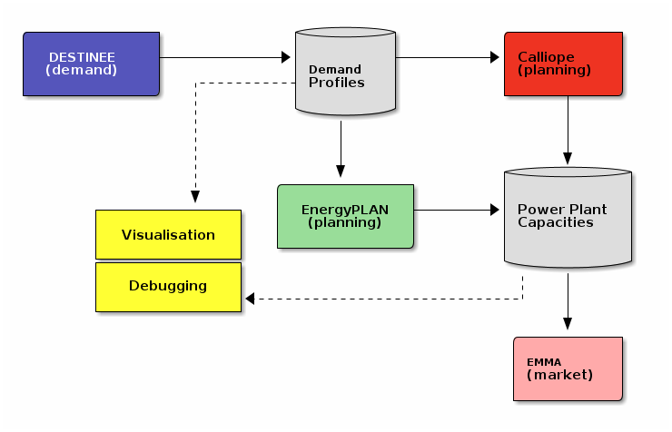

Our objective is to develop a standard through which models in the
SENTINEL ecosystem can interact easily.  To that goal, out approach is
to build a framework that facilitates the flow of data between models
in a way that can be automated. This is challenging because different
models use different data formats, unit conventions, or variable
naming schemes, etc.

   An open ecosystem enabled by the data format, where different
   modelling frameworks can be interlinked, and a suit of independent
   software tools to work with data can be developed.

To address this, we are developing a flexible data standard that can
be the common medium of exchange between different models, allowing
for sharing of results and linking.  The *SENTINEL archive* package,
or ``friendly_data``, implements this framework.  It provides a Command Line
Interface to create and manage data archives (or packages) that can be
easily exchanged between different models in SENTINEL.  It also
provides a Python API to do the same operations and more from within a
computer program.  As the Python language has a very rich ecosystem of
tools for data analysis and visualisation, this opens the the door to
a very powerful analysis environment for collaborative research.  This
framework is available as open source software under the version 2 of
the `Apache software license`_.

.. _`Apache software license`: https://www.apache.org/licenses/LICENSE-2.0
